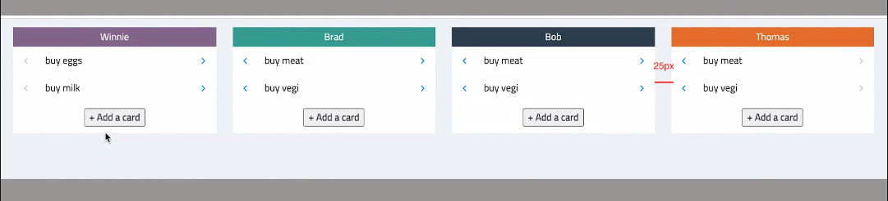
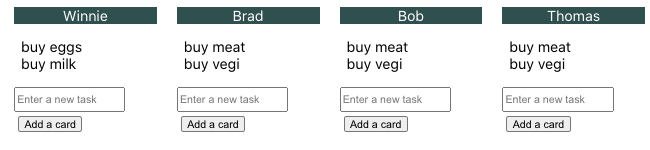
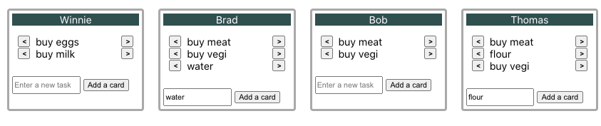
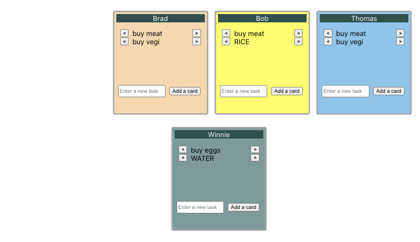
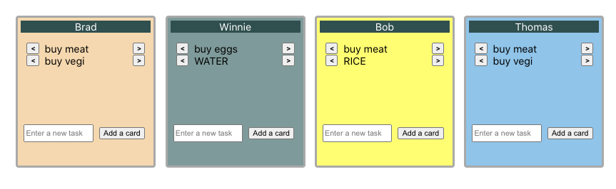

# A Task-Tracking App

About: front-end only; a mini version of task-tracking apps (e.g. JIRA, Trello).

Time limit (Hemlane's tech screen): 50 minutes.
Later, I spent a few hours to review this app, and added interesting/bonus feature(s).

## Table of Contents

- Part 1: The Specs (Input)
- Part 2: My Work (Output)
  - 2(a) My Components, and Learning(s)
  - 2(b) My bonus feature, drag and drop; the learning(s)
  - 2(c): My screenshots (per progress)
- Part 3: Improvements for Future Reference

## Part 1: The Specs (Input)

These are provided by SWE B (on company H's eng team).

1. CSS: same width for the 4 lanes; 25px margin
2. Feature: add a card/task
3. Feature: shift task from 1 person to another

In addition, I added some bonus feature(s).

4. Drag and drop: to re-arrange the lanes/persons, in an intuitive way
   Why: this UI feature is quite common: not only for task management, but also for notes (e.g. [Google Keep](https://keep.google.com/)).

### Screenshot of UI

## Part 2: My Work (Output)

### 2(a) My Components, and Learning(s)

#### App.js (a class)

About: main/class component, where the states live.

My data-structure design for `this.state.taskListByName`:

- Key is a person's name, val is an array of the person's task(s)

- Sample data: `const DEFAULT_TASK_LIST = {Winnie: ["buy eggs", "buy milk"], Brad: ["buy meat", "buy vegi"]}`

- Note here: the key can later be replaced by employee_id, which is surely unique (instead of employee_name)

- General note: a React state should Not be too nested; otherwise, it will be hard for React's state management (Not mutable)

#### Lane.js

About: 1 lane per person; each lane has a list of tasks/cards.

### 2(b) My bonus feature, drag and drop; the learning(s)

How: I coded this feature from scratch (instead of importing an npm module)

My ref links (from research): [answer on stackoverflow.com](https://stackoverflow.com/questions/20926551/recommended-way-of-making-react-component-div-draggable).

Below are the key things added, to enable this feature.

- React states were added: e.g. `dragging` and `nIndexDragged`.

- Lifecycle method: `componentDidUpdate()` was added, to detect the start and end of dragging.

- Several mouse events were added: `onMouseDown()`, `onMouseMove()`, `onMouseOver()` and `onMouseUp()`.
  Note that Web APIs also have methods with closer match, such as [onDrag()](https://developer.mozilla.org/en-US/docs/Web/API/GlobalEventHandlers/ondrag).

- A lot of CSS tweaking.
  - In particular, I ussed CSS in JS (in `App.js` and `Lane.js`), because Standard CSS is not enough (to dynamically set lanes' positions).
  - The details: I added a helper function, `generateLaneStyles()`, which (1) sets up the position of the lanes at the start and (2) updates the lanes' styles along with drag-and-drop (of a lane).

### 2(c): My screenshots (per progress)

For spec 1 and spec 2

For all specs

With bonus feature: drag and drop (plus colored lanes)

## Part 3: Improvements for Future Reference

There are some areas of improvements that could be worked on in the future

- Better UI for entering a new task:
  - My current option: `Lane.js` uses `<input>`. Its disadvantage is taking space on the screen.
  - Option 2 (easy): per SWE B's suggestion, use `window.prompt()`
  - Option 3: apply a customized pop-up window (by tweaking CSS's `display: none`). An example is [Google Keep](https://keep.google.com/)'s adding color to a note.
- Fix some bugs: I noticed there was some edge-case error with my drag-and-drop feature.
