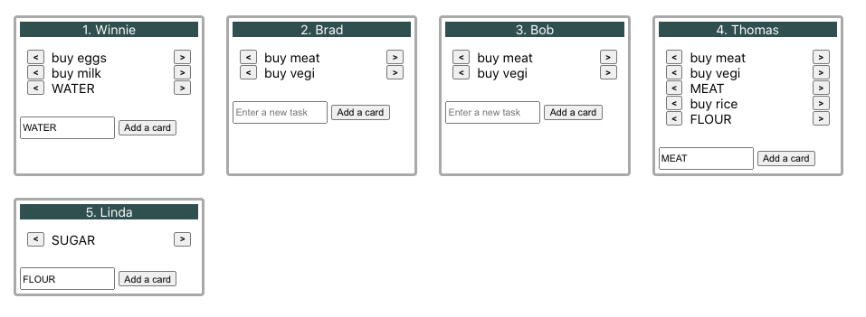

# A Task-Tracking App

About: a very simplified version of apps such as JIRA and Trello.

Time limit: 50 minutes

## Part 1: The Specs (Input)

These are provided by Bihn (SWE on the team).

1. CSS: same width for the 4 lanes; 25px margin
2. Feature: add a card/task
   Note that for entering a new task, B suggested using `Window.prompt()`, whereas I used `<input>`.
3. Feature: shift task from 1 person to another

### Screenshot of UI

## Part 2: My Work (Output)

### 2(a) My Components, and Learning(s)

#### App.js (a class)

About: main/class component, where the states live.

My data-structure design for `this.state.taskListByName`:

- Key is a person's name, val is an array of the person's task(s)

- Sample data: `const DEFAULT_TASK_LIST = {Winnie: ["buy eggs", "buy milk"], Brad: ["buy meat", "buy vegi"]}`

- Note here: the key can later be replaced by employee_id, which is surely unique (instead of employee_name)

- General note: a React state should Not be too nested; otherwise, it will be hard for React's state management (Not mutable)

#### Lane.js

About: 1 lane per person; each lane has a list of tasks/cards.

### 2(b): My screenshots (per progress)

For spec 1 and spec 2

For all specs

